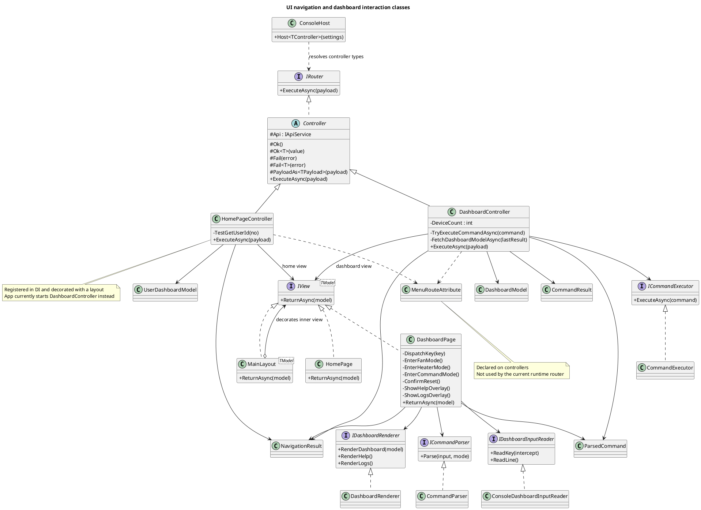
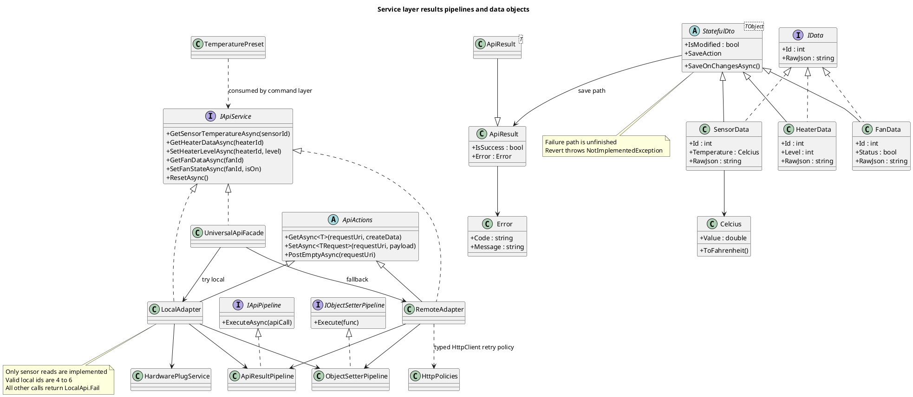
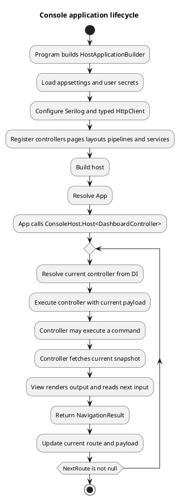
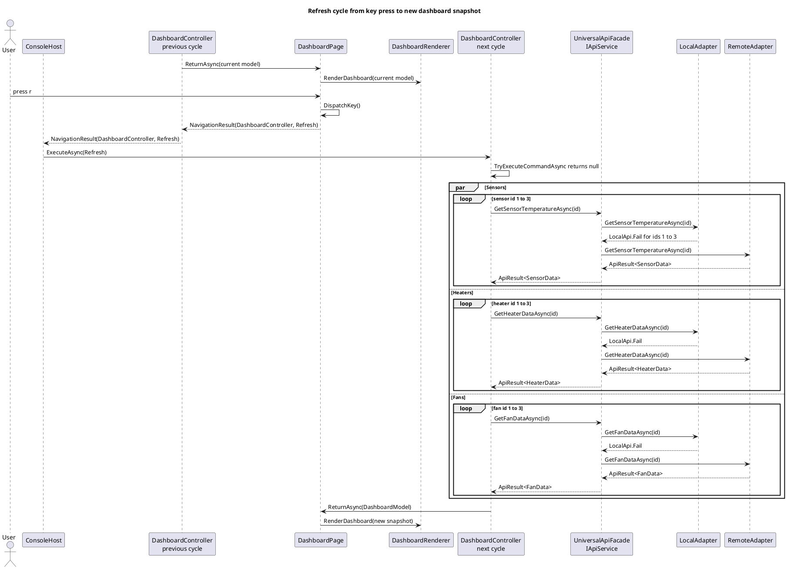
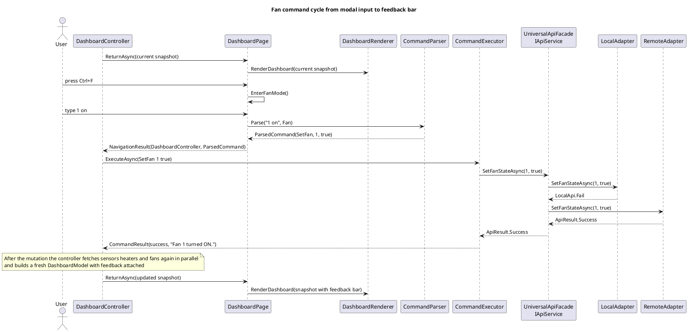

# UML Diagrams

All diagrams below describe the current live architecture of the refactored solution. They intentionally exclude `OldProgram.cs` from the runtime model.

The PlantUML blocks are written to be source controlled and maintained alongside the code. Each diagram is based on direct code inspection rather than inferred architecture alone.

## 1. System Context And Main Components

```plantuml
@startuml
title BeautifulClient current architecture and external dependencies
left to right direction
skinparam componentStyle rectangle

actor User

rectangle "BeautifulClient console app" {
  component "Program\ncomposition root" as Program
  component "App" as App
  component "ConsoleHost" as ConsoleHost
  component "DashboardController" as DashboardController
  component "DashboardPage" as DashboardPage
  component "DashboardRenderer" as DashboardRenderer
  component "CommandParser" as CommandParser
  component "CommandExecutor" as CommandExecutor
  component "UniversalApiFacade" as UniversalApiFacade
  component "LocalAdapter" as LocalAdapter
  component "RemoteAdapter" as RemoteAdapter
  component "ApiResultPipeline" as ApiResultPipeline
  component "ObjectSetterPipeline" as ObjectSetterPipeline
  component "SerilogQueSink\nstatic in process queue" as SerilogQueSink
}

database "User Secrets\nApiSettings ApiKey" as UserSecrets
file "appsettings.json" as AppSettings
folder "logs/app-log-*.txt" as LogFiles
component "HardwarePlugService\nlocal simulation" as HardwarePlugService
cloud "SensorServer\nASP.NET Core mock API" as SensorServer

Program --> AppSettings : load settings
Program --> UserSecrets : load API key
Program --> App : resolve and run
App --> ConsoleHost : Host<DashboardController>()
ConsoleHost --> DashboardController : ExecuteAsync(payload)
DashboardController --> DashboardPage : ReturnAsync(model)
DashboardPage --> DashboardRenderer : render dashboard and overlays
DashboardPage --> CommandParser : parse modal text
DashboardController --> CommandExecutor : execute mutation commands
DashboardController --> UniversalApiFacade : fetch sensors heaters fans
CommandExecutor --> UniversalApiFacade : set fan set heater reset preset
UniversalApiFacade --> LocalAdapter : first attempt
UniversalApiFacade --> RemoteAdapter : fallback on local failure
LocalAdapter --> HardwarePlugService : sensor ids 4 to 6 only
RemoteAdapter --> SensorServer : HTTP with API key
LocalAdapter --> ApiResultPipeline : wrap calls
RemoteAdapter --> ApiResultPipeline : wrap calls
LocalAdapter --> ObjectSetterPipeline : build DTOs
RemoteAdapter --> ObjectSetterPipeline : build DTOs
Program --> SerilogQueSink : configure logging sink
Program --> LogFiles : file logging
DashboardRenderer --> SerilogQueSink : GetLogs()
User --> DashboardPage : key input

note bottom of ConsoleHost
The settings parameter exists
The current implementation starts with payload set to null
end note

note bottom of UniversalApiFacade
Dashboard device ids are 1 to 3
LocalAdapter currently succeeds only for sensor ids 4 to 6
end note
@enduml
```

## 2. UI Navigation And Dashboard Interaction Classes

## 3. Service Layer Results Pipelines And Data Objects

## 4. Application Lifecycle Activity

## 5. Refresh Cycle Sequence

## 6. Fan Command Mutation Sequence

